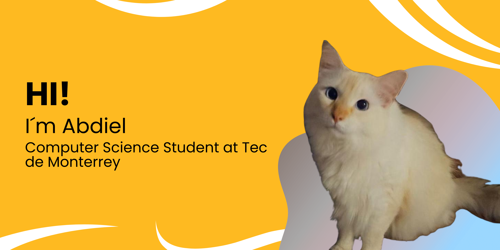

  

  <h1>About me</h1> 
   

* 🎓 My name is Abdiel and I'm a Computer Science student at Tec de Monterrey.
* 💻 I use normally C++ and Python.
* 🧠 Passionate about AI, computer vision, and high-performance computing.

 

  <h1>My Links 🔗</h1> 
   

 |
 |
 -> abdiel23200y@gmail.com |

  <h1>My Stats📊</h1> 
   

  
  
  

